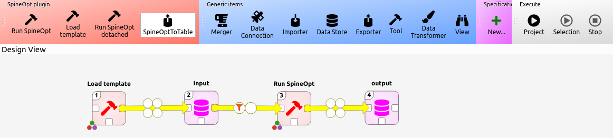

# Spine installation tools

The scripts in this repository are meant as an intermediate step towards full installers. They are meant to automate the installation procedure and to provide a guideline during a manual installation. Additional it is possible to tweak these scripts to your specific needs.

Why is the installation process so complicated? There are many moving parts with interdependencies. There may also be conflicts depending on what is already installed on your system.

For example, Spine Toolbox uses spine databases. The operations that can be performed on those data bases are written in Python. SpineOpt also uses spine database (particularly a SpineOpt database). However, SpineOpt is written in Julia. SpineInterface acts as a compatibility layer between the spine db api in Python and the use of that api in Julia. To that end it heavily relies on PyCall. PyCall depends on the used Python installation and as such there is an interdependency between SpineOpt and Spine Toolbox. PyCall is particularly difficult to work with in a virtual environment as it must be reconfigured every time you change environments.

As may be clear from the installation instructions of different tools in spine tools, there are different ways to install Spine Toolbox, Spine Interface and SpineOpt. The intended way is through releases of Spine Toolbox and built-in functionalities in the settings thereof. However, manual intervention may be needed due to the aforementioned issues. Instead, here we'll cover the most versatile and flexible way to install spine tools: installing from source. This is a complicated process in itself but the scripts in this repository aim to ease that process.

In the following we explain how to use the scripts, how to verify your installation and explain in detail what the scripts actually do.

## Prerequisites
In order for the scripts to work, we need 3 prerequisites:
* Git
* Python >= 3.8
* Julia >= 1.8 (avoid 1.9)

You can check whether each of these is installed correctly by opening the terminal (cmd, powershell, Terminal App, etc.) and type:
```bash
git --version
python3 --version
julia --version
```
For Windows you have to type 'python' instead of 'python3'.

## Installation

So, let's attempt to install spine tools with the scripts.

1. Create a folder where you want to install the tools (I typically choose the name 'spinetools' for that folder) and place the scripts in that folder.
    
2. Run the install script. On Linux open the terminal in the folder and type the name of the file (or use a built-in way of your distribution to run as program). If you are prompted that you do not have the right permissions, grant the permissions with the 'chmod' command (i.e. `chmod +x install_spinetools.sh`). On Windows, right click the install script and open with 'Git for Windows' (alternatively open git bash (comes installed with git) or open a bash terminal in the windows Terminal app, make sure that whatever (bash) terminal shows that you are in the same folder and type the name of the install script). (This is because we're too lazy to create a separate bat file for windows. If there is enough request and/or issues, we may consider creating a bat file anyway.)
    
    
3. Wait until spine toolbox starts. Keep an eye on the output of the script in the console. Any issues will appear here. Be warned, Spine Toolbox can sometimes open even if there are issues with the installation! Pay special attention to messages about the virtual environments and the installation of the packages.
4. Go to file>settings>tools and point toolbox to the correct julia environment. You can find that environment in your spinetools folder under environments.
    
    
    
5. Install spineopt plugin
    

Everything should be fine now. Next time you can run spine tools by running the 'run_spinetools' script. It will automatically load the correct Python and Julia environment.

When you close the console, you will be prompted with a warning. You can safely ignore this message. In the script we tell the console to stay open after the process is completed for debugging purposes.

## Verify installation

We will not explain what is happening here, you can learn how [Spine Toolbox](https://spine-toolbox.readthedocs.io/en/latest/#?badge=latest) and [SpineOpt](https://spine-tools.github.io/SpineOpt.jl/latest/index.html) work from their respective documentations. In short, we'll create a new project in Spine Toolbox where we'll set up a simple workflow for using SpineOpt. We'll create an input database with meaningful data in the SpineOpt format, run SpineOpt on that input and examine the output. The steps to take are:
1. Open Spine Toolbox and create a new project: File > New Project
2. Drag 2 *Data Store* items, the *Load Template* tool and the *Run SpineOpt* tool from the *ribbon* to the *design view*. Each time you drag an item to the design view you are prompted to choose a name for the item. The default names are ok but for clarity we'll name the Data Store items 'input' and 'output'.
3. Connect the items with (yellow) arrows as following: Load Template > input > Run SpineOpt > output
    
4. For each Data Store item
    1. select the Data Store item in the design view by a single click on the item, you should see a *Data Store properties* window (typically to the right of the design view).
    2. Choose the SQL database dialect (sqlite is a local file and works without a server).
    3. Click *New Spine DB* to create a new database (and save it, if it's sqlite).
    
5. For each tool
    1. select the tool in the design view by a single click on the tool, you should see a *Tool properties* window (typically to the right of the design view).
    2. Drag the available sources (i.e. the databases) to the *tool arguments*. The order of matters. Make sure that the input is the first argument and the output is the second argument.
    
6. Select the Load Template tool and press the 'Run Selection' button in the ribbon (and wait until the process is done).
    
7. Download the [data of an existing example](https://github.com/spine-tools/SpineOpt.jl/blob/master/examples/simple_system.json)
8. Double click the input database to open the *spine db editor*.
    1. File > Import
    2. Navigate to the downloaded file and wait until Spine Toolbox indicates that it has imported the data
    3. Save the imported data by pressing the 'commit' button.
    4. Close the spine db editor
    
9. Select the 'Run SpineOpt' tool and press the 'Run Selection' button in the ribbon (or press the 'Run Project' button)
    

If there are no issues along the way and the output of the tool makes sense, you have probably successfully installed spine tools!

## Manual installation

### Create installation folder and download source files

Create a folder to install spine tools. Some system administered systems may not like you installing programs outside of your user folder so you can choose a folder there, e.g. 'spinetools'.

Open the terminal (cmd, powershell, bash, etc.) inside that folder. Check that the terminal shows that it is open in that folder.

Download the files from git:
```git
git clone https://github.com/spine-tools/Spine-Toolbox.git
git clone https://github.com/spine-tools/SpineInterface.jl.git
git clone https://github.com/spine-tools/SpineOpt.jl.git
```

### Optional: select a branch
The following step is optional. Perhaps you want to select a specific branch or release instead of the latest master branch. In that case you can type something along the line of the following (still in the commandline):
```
cd SpineInterface.jl
git fetch
git checkout -b 0.8-dev origin/0.8-dev
cd ..
cd SpineOpt.jl
git fetch
git checkout tags/v0.8.1 -b v081
cd ..
```
In this case we have selected the 0.8-dev branch for SpineInterface and the 0.8.1 release of SpineOpt.

### Python virtual environment

Next up is to create a python environment for the installation Spine Toolbox. We start by making a folder called 'environments' in our 'spinetools' folder.
```bash
mkdir environments
cd environments
```
Then we can create a Python environment called 'penv' in the environments folder.
On Linux:
```bash
python3 -m venv penv
source penv/bin/activate
cd ..
```
On Windows:
```cmd
python -m venv penv
penv/Scripts/activate
cd ..
```
To check whether the correct python is active type:
```bash
which python
```
The path should point towards the environments/penv folder.

(You can use conda instead of Python but we won't go into detail here.)

### Install Spine Toolbox

With the python environment still active in the same terminal, we can install Spine Toolbox with pip. For good measure we first upgrade pip before installing the packages for Spine Toolbox.

```bash
cd Spine-Toolbox
python3 -m pip install --upgrade pip
python3 -m pip install -r requirements.txt
cd ..
```

### Julia virtual environment

For SpineInterface and SpineOpt we have to do something similar.  Except we'll use Julia instead of Python.

For Julia the command to create a virtual environment is the same as activating that environment. So we actually do not need to explicitly do this separately.

### Install SpineInterface

To install SpineInterface, we need to activate the julia environment, install the dependencies for SpineInterface and add SpineInterface as a development package.

The code below is for the same terminal as before but you can also open a Julia REPL and enter the same commands.
```bash
cd SpineInterface.jl
julia -e '
env_julia = joinpath(dirname(@__DIR__),"environments","jenv")
path_spineinterface = joinpath(@__DIR__)
import Pkg
Pkg.activate(env_julia)
Pkg.instantiate()
Pkg.develop(path=path_spineinterface)
'
cd ..
```

### Install SpineOpt

And we do the same for SpineOpt.
```bash
cd SpineOpt.jl
julia -e '
env_julia = joinpath(dirname(@__DIR__),"environments","jenv")
path_spineopt = joinpath(@__DIR__)
import Pkg
Pkg.activate(env_julia)
Pkg.instantiate()
Pkg.develop(path=path_spineopt)
'
cd ..
```

### Configure PyCall

SpineOpt and SpineInterface are now installed from source. The next step is to ensure that PyCall is configured correctly. You can also use these commands to configure PyCall for your different projects.

The first step is again to activate the julia environment. Then we import PyCall, point it to the correct Python environment and then build PyCall.
```bash
julia -e '
env_julia = joinpath(@__DIR__,"environments","jenv")
path_python = joinpath(@__DIR__,"environments","penv","bin","python3")
import Pkg
Pkg.activate(env_julia)
import PyCall
ENV["PYTHON"] = path_python
Pkg.build("PyCall")
'
```

To check whether PyCall uses the correct python executable, you can enter these commands (again activating the environment first).
```bash
julia -e '
env_julia = joinpath(dirname(@__DIR__),"environments","jenv")
path_spineopt = joinpath(@__DIR__)
import Pkg
Pkg.activate(env_julia)
import PyCall
println(PyCall.pyprogramname)
'
```

### Configure Julia in the Spine Toolbox settings

Al that is left to do is some manual stuff inside of Spine Toolbox. In the same terminal we can type 'spinetoolbox' to open the application.

Go to File > Settings > Tools

There we need to check whether Spine Toolbox uses the correct Julia executable and environment.

The Julia executable should be correct but we still need to fill in the environment. You can find it in the spinetools folder > environments folder > jenv

### Install the SpineOpt plugin

In the plugin menu, select the SpineOpt plugin to add a ribbon to Spine Toolbox with easy access to some basic tools for SpineOpt (including a template for a SpineOpt (spine) database and a tool to run SpineOpt).